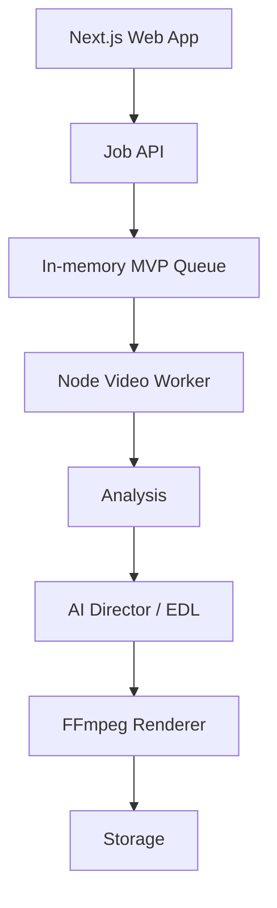

# TaVi AI Montage Studio

Окремий експериментальний вебпроєкт для автоматичного монтажу коротких
Mobile Legends: Bang Bang кліпів у вертикальний MP4 для TikTok, YouTube Shorts
та Instagram Reels.

Цей репозиторій не залежить від основного сайту, бази даних або репозиторію
TaVi Esports.

## Що реально працює

- завантаження до 10 MP4/MOV кліпів;
- локальні preview, видалення та зміна порядку кліпів;
- перевірка MIME, розширення, розміру, тривалості, codec та цілісності;
- `ffprobe` metadata;
- детермінований аналіз руху, змін сцен та аудіоенергії;
- базовий пошук сильних музичних точок;
- AI Director, який створює та зберігає JSON Edit Decision List;
- пояснення, чому кожен фрагмент потрапив у монтаж;
- чотири стилі: Hype Esports, TikTok Viral, Cinematic, TaVi Esports;
- окремі FFmpeg-модулі zoom, punch zoom, shake, flash, speed, slow motion,
  fade, blur transition, glitch та text overlay;
- коротке TaVi intro/outro;
- вертикальний H.264/AAC MP4 із `yuv420p` та `faststart`;
- мікшування оригінального ігрового аудіо з музикою;
- реальний backend job status без імітації прогресу;
- Safari-compatible byte range для вбудованого відеоплеєра;
- повторний рендер з іншим стилем без повторного аналізу кліпів;
- локальне тимчасове storage та очищення за TTL;
- recovery: перервані worker jobs отримують зрозумілий статус помилки.

## Архітектура



Pipeline розділено на три незалежні частини:

1. `ANALYSIS` — збирає вимірювані сигнали з FFmpeg.
2. `EDIT DECISION LIST` — обирає фрагменти, темп, ефекти й музичні точки.
3. `RENDER` — виконує готовий план і не вирішує, який момент «кращий».

Основні каталоги:

```text
app/                         Next.js shell і metadata
components/                  інтерфейс Montage Studio
lib/contracts.ts             спільні API/EDL типи
video-worker/src/analysis/   scene, motion, audio, music analysis
video-worker/src/director/   стилі та AI Director
video-worker/src/jobs/       queue, job state, processing pipeline
video-worker/src/storage/    StorageProvider + local adapter
video-worker/src/video-engine/
  effects/                   незалежні модулі ефектів
  render-segment.ts          нормалізація та рендер фрагмента
  render-montage.ts          intro, clips, outro, music
tests/                       unit, effect smoke та повний E2E
```

## Локальний запуск

Потрібні:

- Node.js `>=22.13`;
- FFmpeg 6+ з `libx264`, `drawtext`, `chromashift`;
- npm.

```bash
npm ci
cp .env.example .env
npm run dev:studio
```

Вебінтерфейс відкриється на `http://localhost:3000`, Video Worker — на
`http://localhost:8788`.

Платний AI API для MVP не потрібний.

## Налаштування

Повний список є у `.env.example`.

Ключові змінні:

| Variable | Default | Purpose |
|---|---:|---|
| `NEXT_PUBLIC_MONTAGE_API_URL` | `http://localhost:8788` | URL worker API |
| `STORAGE_ROOT` | `.studio-data` | uploads, projects, renders |
| `TEMP_FILE_TTL_HOURS` | `24` | час зберігання тимчасових файлів |
| `MAX_CLIPS` | `10` | максимум кліпів |
| `MAX_CLIP_MB` | `250` | максимум одного відео |
| `MAX_CLIP_DURATION_SECONDS` | `180` | максимум тривалості кліпу |
| `RENDER_WIDTH` | `1080` | ширина MP4 |
| `RENDER_HEIGHT` | `1920` | висота MP4 |
| `X264_CRF` | `20` | якість H.264 |

## API

### `POST /api/projects`

`multipart/form-data`:

- `settings` — JSON;
- `clips` — 1–10 MP4/MOV;
- `music` — optional MP3/M4A/WAV/AAC.

Повертає `projectId`, `jobId`, `statusUrl`.

### `GET /api/jobs/:jobId`

Повертає фактичну фазу та відсоток:

`queued → analyzing → selecting → directing → syncing → effects → rendering → complete`

### `GET /api/projects/:projectId/plan`

Повертає збережений Edit Decision List.

### `POST /api/projects/:projectId/rerender`

Приймає нові `settings` і повторно використовує analysis.

### `GET /api/projects/:projectId/render`

MP4 stream/download із підтримкою HTTP Range.

## Тестування

```bash
npm run typecheck
npm run lint
npm run test:unit
npm run test:effects
npm run test:e2e
npm test
```

`test:e2e` сам генерує два тестові MP4 і музику, запускає worker, проходить
upload → metadata → analysis → EDL → render → video range → rerender, після
чого перевіряє результат через `ffprobe`.

`test:effects` окремо рендерить кожен модуль ефекту та перевіряє H.264,
вертикальну роздільну здатність і `yuv420p`.

## Docker worker

```bash
docker compose up --build video-worker
```

Для production frontend можна розмістити окремо, а довгий FFmpeg worker —
на VM/container із CPU/GPU та persistent volume.

Перед публікацією:

1. задати публічний `NEXT_PUBLIC_MONTAGE_API_URL`;
2. додати домен frontend до `ALLOWED_ORIGINS`;
3. замінити `LocalStorageProvider` на S3/R2/Vercel Blob adapter;
4. замінити in-memory queue на Redis/BullMQ або іншу durable queue;
5. поставити auth, rate limits та per-user quotas.

## Чесні обмеження MVP

- Система ще не розпізнає справжні `Savage`, `Maniac`, kill, Lord або Turtle.
- Текст використовує лише нейтральні слова, якщо немає перевіреного event
  recognition.
- Motion/scene/audio analysis знаходить потенційно активні моменти, але не
  розуміє семантику MLBB.
- Speed ramp у першій версії — коротка контрольована зміна playback rate, а не
  optical-flow interpolation.
- Queue локальна й однопроцесна.
- Storage локальне й тимчасове.

Наступний AI-рівень можна додати через окремий vision provider interface, не
змінюючи renderer або API EDL.

## Безпека

- оригінальні імена файлів ніколи не використовуються у shell-командах;
- усі storage names — UUID;
- FFmpeg запускається через `spawn(executable, args)` з `shell: false`;
- worker не складає команди з довільного тексту користувача;
- extensions, MIME, metadata, codec, duration і size перевіряються;
- пошкоджені/unsupported файли повертають зрозумілу помилку;
- intro/text використовують тільки контрольовані рядки;
- uploads/renders ізольовані за `projectId`.
